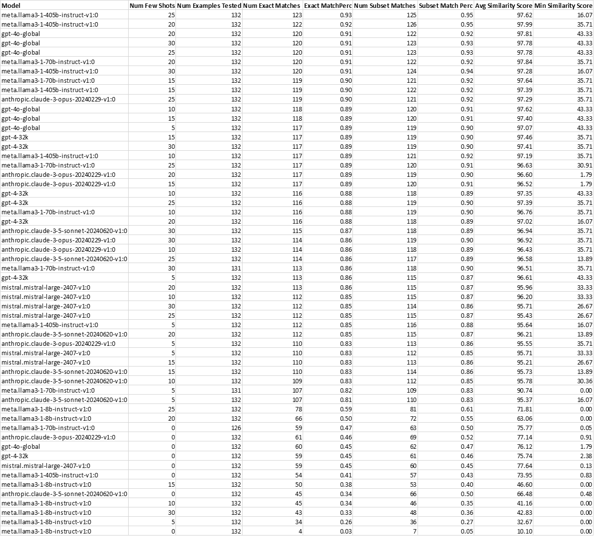

# Summary

Powerful data visualization and analysis packages exist such as CanvasXpress providing rich features for exploring datasets. However, such packages can have a high learning curve and be difficult to use, even requiring detailed web development skills. Here we demonstrate how Large Language Model (“LLM”) AI models can be effectively used to greatly simplify the use of such packages, focusing on CanvasXpress. In our developed system users can simply upload their dataset as a tab-delimited / CSV file or start with any CanvasXpress visualization and then describe in plain English their desired visualization, and the LLM then generates with high accuracy the configuration to create their visualization. We employ as our primary technique few-shot prompting using a set of 132 carefully curated examples of English visualization descriptions and their corresponding correct CanvasXpress configurations (also sending schema information about legal CanvasXpress configuration fields); our system uses retrieval augmented generation (“RAG”) where the few-shot examples are stored and fetched from a vector database based on 
semantic similarity to user queries. To assess the accuracy of our system across multiple well-known LLM models and number of few-shots for RAG, we use the few-shot examples to perform leave one out cross validation. We interestingly find that the recently released Llama 3.1 models are the top performers exactly matching almost 93% of the known correct answers (with average similarity of almost 98%), slightly besting proprietary models from OpenAI and Anthropic and that 20 to 25 few-shot examples for RAG work the best.

# Statement of Need

CanvasXpress [@neuhaus_canvasxpress_nodate] is a powerful JavaScript library that allows one to create interactive and visually appealing graphical representations of data. Unlike traditional charting libraries,  CanvasXpress employs HTML5 canvas technology, offering excellent performance and flexibility in rendering various types of visualizations, including line charts, bar charts, scatter plots, and 3D  graphs. CanvasXpress supports a range of  customization options, allowing users to adjust colors, fonts, and styles to align with their unique  branding requirements. CanvasXpress is an invaluable tool for any data-focused application, bridging the gap between complex data sets and intuitive visual storytelling.

A crucial component of creating visualizations with CanvasXpress is the JSON-format configuration object, which specifies the parameters and features of the visual representation to be generated. While a fundamental configuration can be straightforward, the potential options for customization are numerous, allowing for tailored visual experiences. A basic config might include attributes like chart type (e.g., bar, line, scatter), data source, axis labels, and colors. The data for a CanvasXpress visualization can be given as an "array of arrays", where the first array serves as the column headers and subsequent arrays are the data to be graphed.

While tools like CanvasXpress provide a robust framework for creating dynamic visualizations, the requirement for coding and web development skills can be a barrier for many potential users. It begs the question: can we simplify this process through the application of artificial intelligence? 
By integrating tools like CanvasXpress into an AI-driven platform, users could potentially generate complex visualizations with minimal coding knowledge. For instance, an AI-enabled tool might allow users to upload datasets and describe the types of visualizations they envision in plain language, automatically generating the necessary code and configuration settings.

We have created such a system leveraging LLMs to empower users to easily create powerful visualizations conversationally. To simplify the process of generating visualizations, users can upload a tab or comma-separated file containing both headers and data. This allows for easy 
integration of data into the CanvasXpress platform. Once the data is uploaded, users can simply describe the desired graph in plain English, specifying exactly how they envision the representation of their data. For instance, after uploading a file containing sales data, a user could request, “I want a line graph comparing the quarterly sales growth of Product A and Product B.” [@noauthor_canvasxpress_nodate]

# Implementation

Prompt engineering is a critical aspect of effectively using large language models for varied tasks, specifically for visualization tools in our case, as it determines how well the system understands user inputs and generates correct outputs. A commonly used technique that works very well in practice is few-shot prompting [@schulhoff_showing_2024], where some number of examples of user questions and their corresponding known correct output are given to the LLM to guide it to generate correct answers; basically, it involves providing the LLM an in-context training set to learn from.

By thoughtfully curating a broad and illustrative set of few-shot examples, we can significantly enhance the LLM's ability to generate precise visualizations. We created a collection of 132 representative examples illustrating the diverse capabilities of CanvasXpress. Each example includes a detailed English description followed by the corresponding JSON configuration necessary to create the specified visualizations using the CanvasXpress framework.

In addition to few-shot examples, we also provide the LLM schema information such as possible field names, their types and legal values, and descriptions of the fields. There are approximately 1500 potential configuration fields within the CanvasXpress framework. However, due to context window limits (e.g. 32k max tokens for GPT-4-32K) it’s impractical to consider all the fields simultaneously. Therefore, we determined that focusing on around 150 of the most used fields would suffice for most users and use cases. So as part of our prompt to the LLM we send only the details of these 150 common fields (and any visualization that would require configuration fields outside these 150 is not presently supported).

Retrieval Augmented Generation ("RAG") [@gao_retrieval-augmented_2023] leverages the capabilities of vector databases to enhance the precision and relevance of few-shot examples in a more adaptive and efficient manner (compared to simply sending all). RAG facilitates an efficient retrieval process that identifies the most similar and relevant examples to user queries. We create 1024-dimension dense semantic vectors of all the few-shot English descriptions using the open-source vector embedding model BGE-M3 [@chen_bge_2024], which has demonstrated competetive performance relative to OpenAI embeddings [@borgne_openai_2024], and store them in an on-disk PyMilvus/Milvus [@noauthor_milvus-iopymilvus_2024] vector database. When a user poses a question to the system it is vectorized using BGE-M3 and the generated vector is searched against the vector database for the 25 most semantically similar few-shot examples.

# Assessing Accuracy of the System

To effectively gauge the accuracy of the system's configuration field generation, we employ a structured approach using the few-shot examples to perform Leave One Out Cross Validation [@bobbitt_quick_2020]. This method entails systematically excluding each example one at a time to serve as the test case, while the remaining examples function as the vector-searchable few-shot prompts that can be used as context for the LLM. Over the course of 132 iterations, we compute key accuracy metrics, focusing on the percentage of few-shot examples where the LLM perfectly generates the correct configuration. Additionally, we will assess how frequently the known correct answer is a subset of the LLM generated result.

Furthermore, we quantify the similarity between the outputs generated by the LLM and the established correct answers using a JSON similarity score, ranging from 0 to 100. This metric provides insight into the quality of the generated configurations. We calculate the average and median similarity score, as well as the minimum score across all tests, to identify areas for improvement. By analyzing the results, we can iteratively refine the few-shot examples to improve 
accuracy of the system, particularly focusing on those that yield lower similarity scores (e.g. improve their English descriptions to better match their JSON configs or add other similar examples to “shore up” a possibly underrepresented use case, etc.). This process not only enhances the overall accuracy of the system but also allows for meaningful comparisons of performance between different LLMs, such as GPT-4o [@noauthor_hello_nodate] and the Llama 3.1 [@dubey_llama_2024] models, to determine which model demonstrates superior effectiveness in generating contextually relevant configuration fields.

Finally, in addition to testing different LLM models against each other, we also test various values for the number of few shot examples that are sent as context to the LLM (i.e. which are retrieved by searching against the vector database) to try to determine an optimal value. We tested a number of few shots from 0 to 30 in increments of 5.

See \autoref{fig:table} for the detailed summary results for these tests. Overall, interestingly, the best models for our task (based on both “Exact Match Percentage” and “Average JSON Similarity”) were the open-source Llama 3.1 405B and 70B models, with proprietary OpenAI’s GPT-4o a close second. Overall, Llama 3.1 405B with 25 few shots gave the highest exact match percentage of 93.2%, and based on average JSON similarity it also gave the highest value of almost 98% with 20 few shots. Unfortunately, the 8B version of Llama 3.1 was the worst performer of all, significantly worse than the 70B and 405B variants, so it appears a reasonably large model is needed to perform our task well. The Claude models from Anthropic [@noauthor_meet_nodate], while still giving excellent performance, lagged the Llama 3.1 and OpenAI models. Mistral Large 2407 [@ai_large_2024] gave decent performance, but lagged the others, besting only Llama 3.1 8B. Finally, 20 to 25 appears to be the best value for number of few shot examples, with 30 not performing as well (perhaps more than 25 is starting to overload the LLM with too much information and causing hallucination [@li2024longcontextllmsstrugglelong]).

# User Interface (UI) Integrated into CanvasXpress

We have integrated the LLM generation UI into every CanvasXpress visualization, making it the first standalone JavaScript library to leverage AI on the client side. A JSONP call ensures fast and reliable access to the canvasxpress.org server, with only the prompt, model parameters, and dataset headers being sent to minimize IO load. Alternatively, users can implement their own service, as we also provide the necessary code to create CanvasXpress visualizations. \autoref{fig:UI} illustrates the integrated UI, where users can open a text entry box to describe a new visualization. The response to this call will either replace the current visualization or add a new one below it. Note we are currently working on a new Copilot-like feature which will auto-suggest question completions based on the few-shot examples, to guide users to phrase questions in a way more likely answerable by the LLM (i.e. the more similar a user's question is to a few-shot example the more likely the LLM will generate the correct answer, which should be similar to the few-shot answer).

# References
