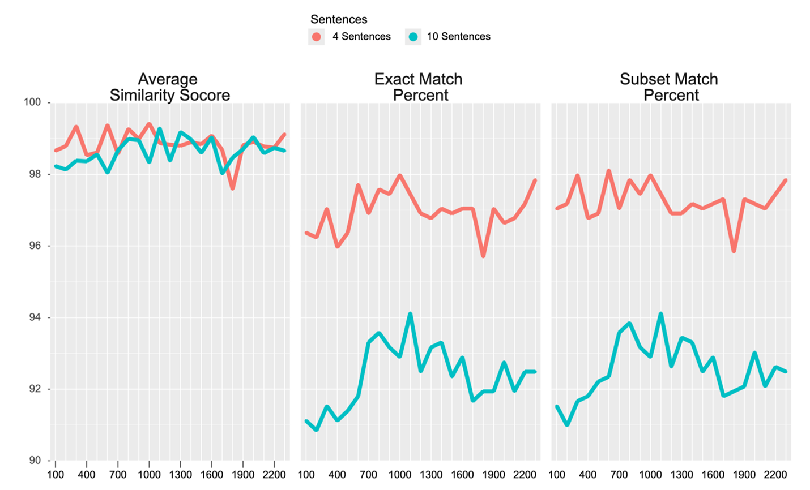
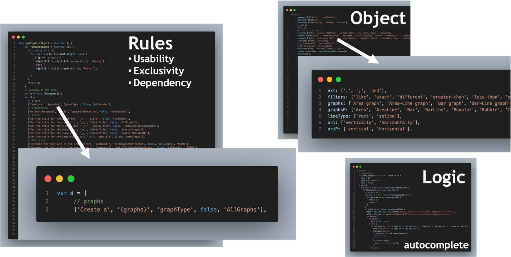

# Summary

Powerful data visualization and analysis packages exist such as CanvasXpress providing rich features for exploring datasets. However, such packages can have a high learning curve and be difficult to use, even requiring detailed web development skills. Here we demonstrate how two techniques, guided autocomplete and Large Language Models (“LLMs”), can be effectively used together in a complementary way to greatly simplify the use of such packages, focusing specifically on CanvasXpress. In our developed system users first upload their dataset as a tab-delimited / CSV file or start with any CanvasXpress visualization and then they are guided to describe in plain English their desired visualization by the system prompting the user to choose from among the legal English continuations at every step. It is not mandatory that the user choose from the guided autocomplete suggestions, they can simply break out and free-form describe their visualization as they please. If the user does follow all the suggestions then the configuration to create their visualization can be created with perfect accuracy, and if not then the LLM serves as a backup and generates with high accuracy the visualization configuration. The guided autocomplete system can also be used to generate at large scale synthetic training data for the LLM, which can be used as a source of "few shot" examples in prompting general LLMs like GPT-4o or as a large enough dataset to fine-tune an LLM to the task of generating CanvasXpress visualization configuration. To demonstrate how the guided autocomplete complements the LLM, and to assess accuracy of LLM generated visualization configuration, we use the guided autocomplete system to generate several thousand synthetic examples, which are used as potential few shot examples for retrieval augmented generation (“RAG”), and assess the accuracy of LLM generated visualization configuration as the number of potential few shot examples increases. We also assess for 3 synthetic datasets of increasing maximum number of sentences per example (4, 6, and 10) to see how accuracy scales as the complexity of the problem increases (i.e. more sentences means more complex). Excellent accuracy (over 96% exactly matching known correct answers) is achieved for all the datasets and increases as the number of potential few shot examples increases, however we do find that accuracy declines for larger numbers of sentences demonstrating that more complex tasks are more difficult for the LLM to handle correctly.

# Statement of Need

CanvasXpress [@neuhaus_canvasxpress_nodate] is a powerful JavaScript library that allows one to create interactive and visually appealing graphical representations of data. Unlike traditional charting libraries, CanvasXpress employs HTML5 canvas technology, offering excellent performance and flexibility in rendering various types of visualizations, including line charts, bar charts, scatter plots, and 3D  graphs. CanvasXpress supports a range of  customization options, allowing users to adjust colors, fonts, and styles to align with their unique branding requirements. CanvasXpress is an invaluable tool for any data-focused application, bridging the gap between complex data sets and intuitive visual storytelling.

A crucial component of creating visualizations with CanvasXpress is the JSON-format configuration object, which specifies the parameters and features of the visual representation to be generated. While a fundamental configuration can be straightforward, the potential options for customization are numerous, allowing for tailored visual experiences. A basic config might include attributes like chart type (e.g., bar, line, scatter), data source, axis labels, and colors. The data for a CanvasXpress visualization can be given as an "array of arrays", where the first array serves as the column headers and subsequent arrays are the data to be graphed.

While tools like CanvasXpress provide a robust framework for creating dynamic visualizations, the requirement for coding and web development skills can be a barrier for many potential users. It begs the question: can we simplify this process for users by allowing them more easily to create visualizations by simply describing them in plain English? By integrating tools like CanvasXpress into an AI-driven platform and using guided autocomplete, users can potentially generate complex visualizations without any coding knowledge.

We have created such a system leveraging guided autocomplete and LLMs to empower users to easily create powerful visualizations conversationally. To simplify the process of generating visualizations, users can upload a tab or comma-separated file containing both headers and data. This allows for easy integration of data into the CanvasXpress platform. Once the data is uploaded, users can be guided to describe the desired graph in plain English, specifying exactly how they envision the representation of their data. For instance, after uploading a file containing sales data, a user could request, “I want a line graph comparing the quarterly sales growth of Product A and Product B.” [@noauthor_canvasxpress_nodate]

# Implementation

## Guided Autocomplete

Guided autocomplete is a technique that helps users generate prompts by suggesting potential completions based on their inputs. It guides them to build up a complete prompt incrementally based on what they have typed so far. For example, they might start by typing “Create” and then they would be offered possible valid completions like “a bar graph”, “a line chart”, etc. that they could select from. An important benefit of this kind of guided autocomplete is that, if users generate their prompt using it, then the correct CanvasXpress JSON configuration can be generated with perfect accuracy (unlike an LLM which can make mistakes, but can still be used as an alternative way of converting user prompts to JSON configuration if the user doesn’t use the guided autocomplete and simply freeform types in their prompt). This method draws parallels to the "menu-based natural understanding" approach used in the 1980s [@tennant_menu-based_1984], which employed context-free grammars and predictive parsing to develop natural language interfaces to SQL databases. In CanvasXpress, the guided autocomplete system is called the "CoPilot". \autoref{fig:guided_autocomplete} gives an overview of how the Copilot/guided autocomplete works.

Copilot ensures perfect accuracy without the need to call the LLM, with the LLM serving as a backup strategy (when users don't use the copilot). Another significant beneficial feature of the guided autocomplete implementation is that it can be used to generate many synthetic prompt/config pairs that can be utilized as few-shot examples for the LLM to enhance accuracy or even to generate a large-scale training set to  fine-tune an LLM for potentially even better results.

## Prompt Engineering

Prompt engineering is a critical aspect of effectively using large language models for varied tasks, specifically for visualization tools in our case, as it determines how well the system understands user inputs and generates correct outputs. A commonly used technique that works very well in practice is few-shot prompting [@schulhoff_showing_2024], where some number of examples of user questions and their corresponding known correct output are given to the LLM to guide it to generate correct answers; basically, it involves providing the LLM an in-context training set to learn from.

We utilized the Copilot’s ability to generate largescale synthetic few shot examples in order to perform accuracy tests of how well an LLM can generate CanvasXpress JSON configuration from an English prompt. Each example includes a detailed English description followed by the corresponding JSON configuration necessary to create the specified visualizations using CanvasXpress.

In addition to few-shot examples, we also provide the LLM schema information such as possible field names, their types and legal values, and descriptions of the fields. There are approximately 1500 potential configuration fields within the CanvasXpress framework. However, due to LLM context window limits it’s impractical to consider all the fields simultaneously. Therefore, we determined that focusing on around 150 of the most used fields would suffice for most users and use cases. So as part of our prompt to the LLM we send only the details of these 150 common fields (and any visualization that would require configuration fields outside these 150 is not presently supported).

Retrieval Augmented Generation ("RAG") [@gao_retrieval-augmented_2023] leverages the capabilities of vector databases to enhance the precision and relevance of few-shot examples in a more adaptive and efficient manner (compared to simply sending all). RAG facilitates an efficient retrieval process that identifies the most similar and relevant examples to user queries. We create 1024-dimension dense semantic vectors of all the few-shot English descriptions using the open-source vector embedding model BGE-M3 [@chen_bge_2024], which has demonstrated competetive performance relative to OpenAI embeddings [@borgne_openai_2024], and store them in an on-disk PyMilvus/Milvus [@noauthor_milvus-iopymilvus_2024] vector database. When a user poses a question to the system it is vectorized using BGE-M3 and the generated vector is searched against the vector database for the 25 most semantically similar few-shot examples.

# Assessing Accuracy of the System

We tried to assess the impact of 2 important factors: total number of few shot examples, and complexity of prompts (where we measure complexity of prompts by how long they are, or specifically in our case the maximum number of sentences they contain). How does accuracy vary with the number of few-shot examples used? We conducted tests in increments of 100: 100, 200, 300, up to 2500. Additionally, how does accuracy change when comparing longer prompts to shorter ones? We evaluated prompts having maximum lengths of four sentences (i.e. less complex), six sentences and ten sentences (more complex). In addition for each synthetic prompt, we generated three alternative phrasings using GPT-4o to ensure variety of expression. Note that not all few shots will be utilized and sent to the LLM for each prompt, but the number of possible few shot examples will increase, and our RAG approach will choose the most similar 25 few shots for each test prompt.

We assess accuracy of LLM-generated CanvasXpress JSON configuration using a few key metrics: exact match percentage (i.e. LLM generated JSON config is exactly the same as the known correct answer), subset match percentage(i.e. the known correct answer is a subset of the LLM generated result), and JSON similarity score (a measure of how different two JSON objects are recursively in terms of different keys and values). See the 3 graphs for full results, but here are some key takeaways. These metrics tend to improve with an increased number of few-shot examples. However, the accuracy for the max 4 sentence dataset seems to plateau for around 1300 possible few shot examples, and in fact accuracy decreases for larger numbers of few shots. However, accuracy increases steadily, with no plateu, for the max 10 sentence dataset, indicating even more few shot examples could improve accuracy even more. 

More notably, accuracy is significantly better with datasets containing sentences of up to four words compared to those with six or ten words (and six is better than ten). This suggests that longer, more complex descriptions of visualizations pose greater challenges for LLMs to generate accurately. How generalizable is this finding (e.g. would it similarly effect other chatbots such as against databases?) And how could it be addressed? We hope to explore this more in the future, but here are some ideas. One potential solution could be to employ a divide-and-conquer approach, constructing a final answer in more precise, incremental steps rather than attempting to generate it all at once. “Chain of Thought” prompting seems related to this and might also give improved results.

Looking ahead, we plan to develop a fine-tuned LLM using synthetic data generated by the Copilot. Fine-tuning necessitates at least thousands of examples, which can be effortlessly generated by the copilot, while manually creating such a large dataset is challenging. The potential for improved accuracy through fine-tuning is significant, for instance, SQLcoder achieves 93% accuracy compared to GPT-4's 86% in generating SQL from English text.

# User Interface (UI) Integrated into CanvasXpress

We have integrated the Copilot and LLM generation UI into every CanvasXpress visualization, making it the first standalone JavaScript library to leverage AI on the client side. A JSONP call ensures fast and reliable access to the canvasxpress.org server, with only the prompt, model parameters, and dataset headers being sent to minimize IO load. Alternatively, users can implement their own service, as we also provide the necessary code to create CanvasXpress visualizations. \autoref{fig:UI} illustrates the integrated UI, where users can open a text entry box to describe a new visualization (either guided by the copilot or typed freely). If the copilot was fully used, no call to the LLM is required (config is generated by the copilot in the browser), otherwise the LLM is called. The resulting config will either replace the current visualization or add a new one below it.

# References
