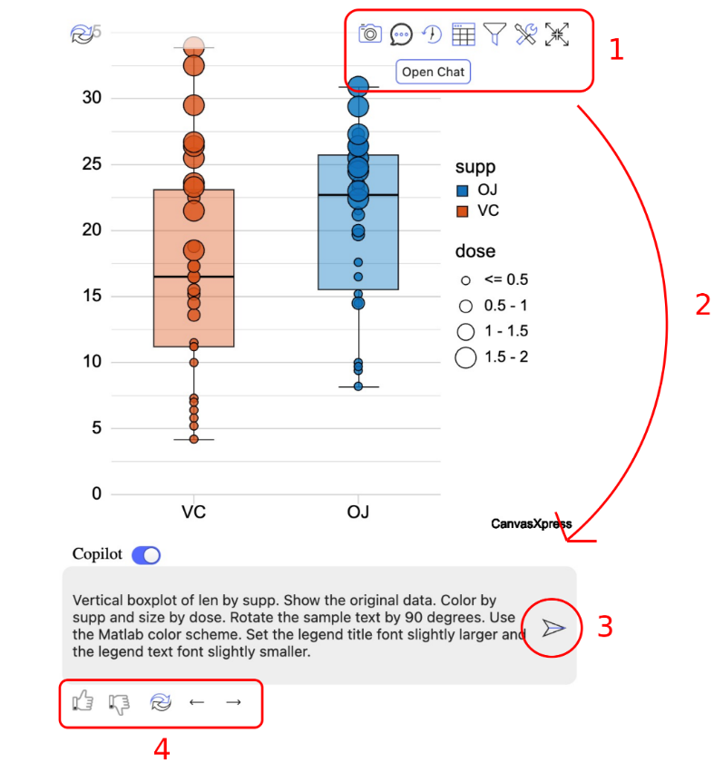

# Summary

Powerful data visualization packages like CanvasXpress offer rich features for exploring datasets but often have a high learning curve, requiring detailed web development skills. We present a system that combines guided autocomplete and Large Language Models (LLMs) to simplify the use of such packages, focusing specifically on CanvasXpress. Users upload tabular data or start from any CanvasXpress visualization, then describe their desired visualization in plain English—either by following guided suggestions or typing free-form text. Guided autocomplete ensures perfect configuration accuracy, while LLMs serve as a robust backup for flexible, free-form input. The system can also generate large-scale synthetic training data for use as few-shot examples or for fine-tuning. We evaluate accuracy of LLM CanvasXpress configuration generation using thousands of synthetic examples with Retrieval Augmented Generation (RAG), achieving over 97% exact match accuracy. Results show that accuracy increases with more few-shot examples but decreases with prompt complexity, highlighting the challenge of generating complex visualizations from natural language.

# Statement of Need

CanvasXpress [@neuhaus_canvasxpress_nodate] is a JavaScript library for interactive data visualizations using HTML5 canvas technology. It supports a wide range of chart types and allows extensive customization through JSON configuration objects. However, the need for coding skills creates barriers for domain scientists in genomics, proteomics, and clinical studies, who may have deep field knowledge but limited programming experience. This presents a research challenge: can we enable visualization creation through natural language, lowering the technical barrier and accelerating scientific discovery?

Our system leverages guided autocomplete and LLMs for conversational visualization generation. CanvasXpress is particularly suitable for LLM-based generation due to its well-structured JSON schema, declarative approach, sensible defaults, and scientific domain focus. Unlike procedural libraries that require complex code generation, CanvasXpress’s declarative configurations are natural targets for LLMs. While other libraries like Plotly also use JSON, CanvasXpress’s schema and domain focus make it especially well-suited for this approach.

To simplify visualization generation, users upload tabular data (CSV/TSV) and describe the desired graph in plain English, such as “I want a line graph comparing the quarterly sales growth of Product A and Product B.” The system guides users with autocomplete suggestions or allows free-form input, making visualization accessible to non-programmers.

# Implementation

## Guided Autocomplete

Guided autocomplete helps users build prompts incrementally by suggesting valid completions at each step. For example, typing "Create" offers options like "a bar graph" or "a line chart." This approach, inspired by menu-based natural language systems [@tennant_menu-based_1984], ensures perfect accuracy when followed, as the system can deterministically generate the correct CanvasXpress JSON configuration. If users deviate from suggestions, the LLM serves as a backup, interpreting free-form input to generate the configuration. The guided autocomplete system, called "Copilot," can also generate synthetic prompt/configuration pairs at scale, which are used as few-shot examples for LLM prompting or as training data for fine-tuning (we also use in a train/test split for our accuracy testing).

## Prompt Engineering and Retrieval Augmented Generation (RAG)

Prompt engineering is critical for effective LLM use in visualization tasks. We employ few-shot prompting [@brown_language_2020; @schulhoff_showing_2024], where the LLM is provided with several example user queries and their correct outputs. All few-shot examples are generated automatically by the guided autocomplete system, not manually curated, enabling the creation of thousands of diverse, high-quality examples efficiently. Users can also enrich the system with their own few-shot examples if desired.

Due to LLM context window limits, we provide schema information for the ~150 most-used CanvasXpress fields (out of ~1500 total), which suffices for most use cases. Retrieval Augmented Generation (RAG) [@gao_retrieval-augmented_2023] uses vector databases to efficiently select the most relevant few-shot examples for each user query. We create 1024-dimensional semantic vectors of all few-shot English descriptions using the BGE-M3 embedding model [@chen_bge_2024], storing them in a PyMilvus/Milvus [@wang_milvus_2021; @guo_manu_2022] vector database. User queries are vectorized and searched against the vector database to retrieve the 25 most semantically similar examples.

# Assessing Accuracy

We evaluated two factors: the number of few-shot examples (100–2500 in increments of 100) and prompt complexity (maximum 4, 6, or 10 sentences). For each synthetic prompt, we generated three alternative phrasings using GPT-4o to ensure diversity of expression. Accuracy metrics include exact match percentage and a JSON similarity score, which recursively compares structure and values of generated and reference configurations.

Few-shot examples were systematically generated to cover common chart types, different data structures, and customization options. We generated up to 2,500 examples for evaluation across complexity levels. Results show that accuracy improves with more few-shot examples and then plateaus, with the 4-sentence dataset showing a slight decrease around 1800 examples. Accuracy is excellent (>97%) for all datasets but decreases with complexity—4-sentence prompts outperform 6-sentence, which outperform 10-sentence prompts. This suggests that longer, more complex descriptions pose greater challenges for LLMs.

Future work includes fine-tuning LLMs using synthetic data (thousands of examples easily generated by the Copilot). We have already developed a basic agentic version of the system using AWS Bedrock, and we plan to further enhance and expand this as future work (see the “User Interface” section below for details).

While the system achieves high accuracy for most use cases, there are current limitations. Due to LLM context window constraints, only the 150 most-used CanvasXpress fields are supported, and very complex, multi-step visualization requests may still challenge current LLMs. In future work, we plan to expand schema coverage, explore chain-of-thought prompting, and implement divide-and-conquer strategies for handling more complex tasks.

# Research Impact and Applications

Our system addresses research challenges by: (1) reducing time from analysis to visualization, enabling faster hypothesis generation and testing; (2) allowing researchers to explore more visualization options without technical barriers; (3) eliminating the need for specialized programming support; and (4) accelerating research in data-intensive domains. For example, genomics researchers can generate complex heatmaps by describing "show me a heatmap of gene expression levels across tissue types, clustered by similarity" rather than learning JSON syntax.

# Related Work

While RAG and few-shot learning are established in machine learning, their application to scientific visualization generation is novel. Standard RAG focuses on text generation, whereas we generate structured JSON configurations. Our approach uses guided autocomplete for automatic synthetic example generation, avoiding manual curation typical in few-shot applications.

Most visualization libraries present challenges for LLM generation: D3.js requires DOM manipulation, ggplot2 uses sequential function calls, and Matplotlib relies on procedural commands. These require syntactically correct executable code rather than declarative configurations. CanvasXpress’s JSON-based approach creates natural LLM targets with graceful parameter handling and meaningful defaults.

# User Interface

We integrated the Copilot and LLM generation UI into every CanvasXpress visualization, making it the first standalone JavaScript library leveraging client-side AI. JSONP calls ensure fast access to canvasxpress.org servers, sending only prompts, parameters, and headers to minimize load. Users can also implement their own services. The integrated UI allows describing new visualizations through guided Copilot or free-form text, with results replacing current visualizations or adding new ones.

The system is implemented as a professional Python package with modular architecture, featuring comprehensive automated testing with over 85 unit and integration tests validating both real API functionality and graceful fallback to mock responses when external services are unavailable.

We have also developed an initial agentic version of our system using AWS Bedrock, which lays the groundwork for capabilities beyond simple visualization generation. While still in its early stages, this agent-based implementation is designed to eventually support autonomous interaction with multiple data sources, execution of complex multi-step analysis workflows, and integration with other AI agents for comprehensive data analysis and visualization pipelines. As the system matures, the agentic architecture is intended to enable more sophisticated use cases, such as automatically suggesting appropriate visualization types based on data characteristics, performing data preprocessing and validation, and generating multiple complementary visualizations to support comprehensive data exploration.

# References